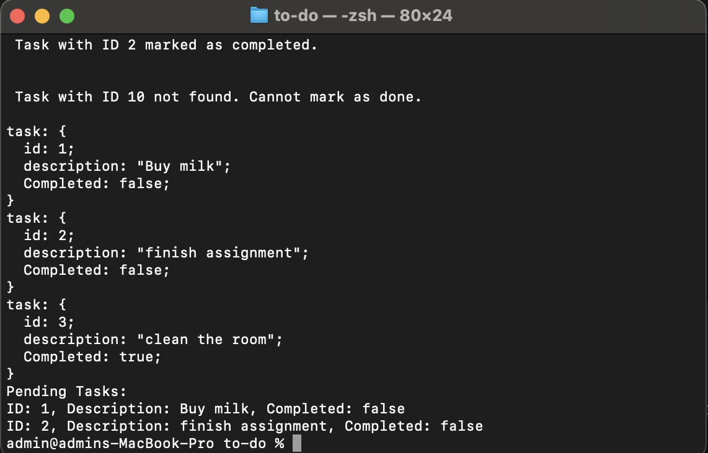

#  Todo List Manager

---
## Description
- A To-Do List App is a simple command-line interface that allows users to add, view, update, and delete tasks they need to complete.

---

##  Table of Contents

- [Todo List Manager](#todo-list-manager)
  - [Description](#description)
  - [Table of Contents](#table-of-contents)
  - [Features](#features)
  - [Tech Stack](#tech-stack)
  - [Installation \& setup](#installation--setup)
      - [Clone:](#clone)
  - [Contributing](#contributing)
  - [Contact](#contact)
  - [Sample Output](#sample-output)

---

##  Features
- It is a simple To-Do list app, It can be use every day to track your tasks. 
- It has a user can add new Task to the Todo list1 
- Tasks are added using the addTask(description: string) function and marked complete using markTaskAsDone(id: number) 
- If we give a parameter which Id work dodn that will be show true.  
- It show a pending list of task, task.user can easily findout which tasks are not yet completed.   
##  Tech Stack

- Node Js

- TypeScript
 
---
## Installation & setup

1. To clone the project enter the below command in the terminal with the path you want to create your project folder.

#### Clone:

  https://github.com/SowmyaT-157/to-do-list


- To Install Node.js click the link
       [Node.js](https://nodejs.org/)
- To check the Node.js
    - node -v
    - It will display the version of the node
- To install dependencies 

 ``` bash
    npm install
 ```
- To install typescript package.
   
 ```　bash
    npm install -g typeScript
    
 ```


2. To start the project use the below command in the terminal.
* To compile the ts file
``` bash
    tsc
```
* To run the js file
```bash
    npm run start
```
* To run the unit test - jest
```bash
    npm test
``` 
---
## Contributing
1.Fork the repository

2.Create a new branch (git checkout -b feature-branch).

3.Make your changes and commit them (git commit -m "Add new feature").

4.Push to the branch (git push origin feature-branch).

5.Create a pull request.

---

## Contact

For any issues or in Queries ,contact Sowmya T_157

 https://github.com/SowmyaT-157

## Sample Output
 

